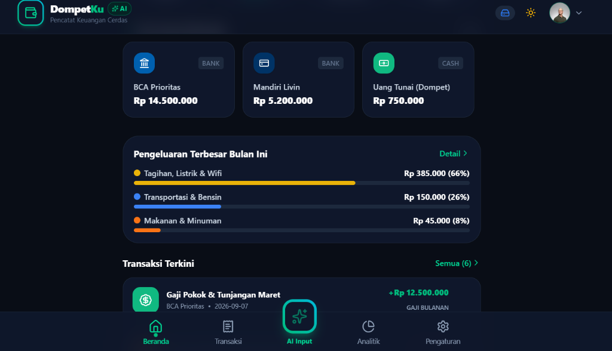

# DompetKu AI • Catatan Keuangan Pintar Mobile-Friendly

<div align="center">

  

  # 💸 DompetKu AI
  ### Aplikasi Pencatat Keuangan Pintar & Modern Berbasis AI Mobile-First

  Dibuat dan Dikembangkan dengan ❤️ oleh **[Naufal Irfansyah](https://www.instagram.com/naufal_irfansyah)** ([@naufal_irfansyah](https://www.instagram.com/naufal_irfansyah))

  <p align="center">
    <a href="https://catatan-keuangan-nfl.vercel.app">
      
    </a>

    <a href="https://github.com/naufalirfan/catatan-keuangan">
      
    </a>
    <a href="https://www.instagram.com/naufal_irfansyah">
      
    </a>
  </p>

  <p align="center">
    
    
    
    
    
    
  </p>

</div>

---

## 📖 Tentang Aplikasi

**DompetKu AI** adalah platform web aplikasi manajemen keuangan pribadi (*Personal Finance & Expense Tracker*) yang didesain secara khusus mengutamakan pengalaman seluler (*mobile-first*). Aplikasi ini menggabungkan kecepatan pencatatan manual dengan kemampuan otomatisasi kecerdasan buatan (**Google Gemini AI**).

Pengguna dapat mencatat pengeluaran harian hanya dengan mengetik bahasa santai, mendiktekan suara, maupun memotret struk belanja. Dilengkapi pemisahan data mutlak per akun (**1 Akun 1 Catatan**), sistem berjenjang **Mode PRO & FREE**, serta autentikasi resmi **Google OAuth**.

---

## 🌟 Fitur Utama & Keunggulan

### 1. 📱 Pengalaman Antarmuka Mobile-First
- **Navigasi Ergonomis**: Dilengkapi *Bottom Navigation Bar* modern (Beranda, Riwayat Transaksi, Tombol Tengah Khusus Input AI, Laporan Analitik, dan Pengaturan).
- **Mode Gelap & Terang (Dark / Light Mode)**: Dukungan tema ganda yang ramah mata dengan peralihan instan di navbar atas dan penyimpanan status di browser.
- **Kartu Finansial Interaktif**: Menampilkan Saldo Bersih, Pemasukan Bulan Ini, Pengeluaran Bulan Ini, Arus Kas Bersih (*Net Cash Flow*), serta fitur sensor privasi (*Hide/Show Balance*).
- **Multi-Dompet & Rekening**: Kelola dompet fisik (*Cash*), rekening bank (BCA, Mandiri, BRI, BNI), *e-wallet* (GoPay, OVO, ShopeePay, DANA), hingga akun investasi/reksadana secara terpisah.

### 2. 🧠 Input Cerdas Berbasis AI (Artificial Intelligence)
- **Natural Language Parsing**: Ekstraksi transaksi otomatis dari kalimat sehari-hari dalam Bahasa Indonesia.
  - *Contoh:* `"Beli kopi kenangan 28rb pake gopay jam 2 siang"` ➔ Terdeteksi: Pengeluaran, Rp 28.000, Makanan & Minuman, GoPay, Tanggal & Jam hari ini.
  - *Contoh:* `"Gaji bulanan 8.5jt masuk rekening BCA"` ➔ Terdeteksi: Pemasukan, Rp 8.500.000, Gaji Pokok, BCA.
- **Dikte Suara (Voice Input)**: Integrasi *Web Speech API* memungkinkan pengguna mencatat keuangan hanya dengan berbicara ke mikrofon smartphone.
- **Scan Struk Belanja (Vision OCR)**: Unggah foto struk/nota belanja dari kamera ponsel, AI akan membaca total belanja dan toko secara otomatis.
- **Dialog Konfirmasi**: Setiap hasil analisis AI dapat diperiksa dan disesuaikan sebelum disimpan ke pembukuan.

### 3. 👑 Sistem Hak Akses & Paket Akun (Mode PRO & FREE)
- **1 Akun 1 Catatan (Data Isolation)**: Setiap akun memiliki ruang penyimpanan data yang sepenuhnya terisolasi. Data transaksi Anda tidak akan pernah bercampur dengan akun lain.
- **Mode FREE**:
  - Kuota hingga 50 transaksi tercatat.
  - Maksimal 3 rekening/dompet aktif.
  - Akses fitur AI standar.
- **Mode PRO (Rekomendasi)**:
  - **Unlimited** catatan transaksi tanpa batas.
  - **Unlimited** dompet, rekening bank & e-wallet.
  - **Input AI & Scan Struk Tanpa Batas**.
  - Ekspor data laporan Excel / CSV & Cadangan Cloud.
- **Hak Khusus Superadmin**:
  - Memiliki akses penuh ke panel kontrol konfigurasi AI (Gemini API Key, Custom Endpoint URL, dan Bearer Token).

  - Member biasa tidak perlu memikirkan teknis API key; mereka langsung menikmati fitur AI yang telah disiapkan Superadmin.
  - Sakelar instan di dashboard untuk mengubah status akun kapan saja.
- **Popup Pilihan Paket**: Otomatis menyapa pengguna saat pertama kali berhasil masuk.

### 4. 📊 Laporan Finansial & Evaluasi Anggaran (Budgeting)
- **Grafik Komposisi Pengeluaran**: Visualisasi kategori pengeluaran terbesar per bulan.
- **Tingkat Tabungan (*Savings Rate*)**: Indikator persentase pemasukan yang berhasil disisihkan untuk tabungan dan investasi.
- **Batas Anggaran (*Budget Limits*)**: Tetapkan batas maksimal pengeluaran per kategori dengan peringatan progres visual (Aman, Waspada >75%, Melebihi Anggaran >100%).

### 5. 🔐 Autentikasi Google OAuth & Keamanan Data
- Terhubung langsung dengan **Google Identity Services (GIS)** untuk login aman 1-klik tanpa perlu mengingat password baru.
- Mode fallback akun Demo / Tamu untuk mencoba seluruh fitur aplikasi secara instan.
- Dukungan sinkronisasi multi-perangkat via **Supabase Cloud** dan *offline-first cache* berkecepatan tinggi via **LocalStorage**.
- Fitur pencadangan data lokal (**Export/Import JSON**) serta ekspor laporan riwayat ke file spreadsheet (**CSV / Excel**).

---

## 🛠️ Arsitektur Teknologi

| Komponen | Teknologi yang Digunakan |
| :--- | :--- |
| **Framework Utama** | [Next.js 16.3.5](https://nextjs.org/) (App Router, Turbopack) |
| **Pustaka UI** | [React 19](https://react.dev/) & [Lucide Icons](https://lucide.dev/) |
| **Sistem Desain** | [Tailwind CSS v4.0](https://tailwindcss.com/) (Modern Color Tokens & Dark Mode) |
| **Kecerdasan Buatan** | [Google Generative Language API](https://ai.google.dev/) (Gemini Flash) & Custom REST Proxies |
| **Autentikasi** | [Google Identity Services (GIS)](https://developers.google.com/identity) & Supabase Auth |
| **Basis Data Cloud** | [Supabase PostgreSQL](https://supabase.com/) dengan Row Level Security (RLS) |
| **Animasi & Haptic** | Canvas Confetti & CSS Micro-Interactions |
| **Hosting & CI/CD** | [Vercel Edge Network](https://vercel.com/) |

---

## 🚀 Panduan Menjalankan di Lokal (Local Development)

### Prasyarat
- [Node.js](https://nodejs.org/) versi 18 ke atas (disarankan Node.js 20+)
- Git terpasang di komputer Anda

### Langkah-langkah:
1. **Clone Repository:**
   ```bash
   git clone https://github.com/naufalirfan/catatan-keuangan.git
   cd catatan-keuangan
   ```

2. **Pasang Dependensi:**
   ```bash
   npm install
   ```

3. **Konfigurasi Environment Variables:**
   Salin file `.env.example` menjadi `.env.local`:
   ```bash
   cp .env.example .env.local
   ```
   Isi konfigurasi berikut sesuai kebutuhan:
   ```env
   # Google OAuth Client ID (Google Identity Services)
   NEXT_PUBLIC_GOOGLE_CLIENT_ID=your_google_client_id_here.apps.googleusercontent.com

   # Supabase Configuration
   NEXT_PUBLIC_SUPABASE_URL=https://your-project-id.supabase.co
   NEXT_PUBLIC_SUPABASE_ANON_KEY=your_supabase_anon_key_here

   # Gemini / Custom AI Configuration (Opsional di env, bisa diatur lewat menu Pengaturan Superadmin)
   NEXT_PUBLIC_GEMINI_API_KEY=
   NEXT_PUBLIC_AI_ENDPOINT=https://your-custom-router.com/v1
   NEXT_PUBLIC_AI_AUTH_TOKEN=your_secret_token_here
   NEXT_PUBLIC_AI_MODEL=jaa
   ```


4. **Jalankan Server Lokal:**
   ```bash
   npm run dev
   ```
   Buka peramban Anda di [http://localhost:3000](http://localhost:3000).

---

## 🗄️ Skema Database Supabase

Jika ingin menghubungkan ke proyek Supabase pribadi, buka **SQL Editor** di Supabase Dashboard dan jalankan kueri yang ada di file [supabase_schema.sql](supabase_schema.sql). Skema tersebut mencakup:
- Tabel `profiles`: Menyimpan data pengguna Google OAuth.
- Tabel `accounts`: Menyimpan saldo multi-dompet dan rekening.
- Tabel `categories`: Kategori pemasukan dan pengeluaran.
- Tabel `transactions`: Rekaman transaksi keuangan terperinci.
- Tabel `budgets`: Batas target anggaran bulanan.
- Indeks performa & Kebijakan Keamanan Tingkat Baris (*Row Level Security / RLS*).

---

## 👨‍💻 Profil Pengembang

Aplikasi ini dirancang dan dikembangkan oleh:

* **Nama:** [Naufal Irfansyah](https://www.instagram.com/naufal_irfansyah)
* **Instagram:** [@naufal_irfansyah](https://www.instagram.com/naufal_irfansyah)
* **GitHub:** [@naufalirfan](https://github.com/naufalirfan)

Jangan ragu untuk mengunjungi profil Instagram **[@naufal_irfansyah](https://www.instagram.com/naufal_irfansyah)** untuk diskusi, kolaborasi, atau memberikan kritik & saran yang membangun!


---

## 📄 Lisensi

Hak Cipta © 2026 **[Naufal Irfansyah](https://www.instagram.com/naufal_irfansyah)**.  
Dilisensikan di bawah lisensi [MIT](LICENSE).
